<!-- Header -->
<p align="center">
  
</p>

<p align="center">
  <a href="https://apollosuny-portfolio.pages.dev/">
    <picture>
      <source media="(prefers-color-scheme: dark)" srcset="https://readme-typing-svg.demolab.com?font=JetBrains+Mono&weight=600&size=20&duration=3200&pause=900&color=4AA8FF&center=true&vCenter=true&width=620&lines=Backend+systems%2C+built+to+scale.;From+the+first+diagram+to+the+pipeline+that+ships+it.;APIs+%C2%B7+Cloud+%C2%B7+Cross-chain+%C2%B7+AI" />
      
    </picture>
  </a>
</p>

<p align="center">
  <a href="https://apollosuny-portfolio.pages.dev/"></a>
  <a href="https://www.linkedin.com/in/apollosuny/"></a>
  <a href="mailto:baotrung06092003@gmail.com"></a>
  <a href="https://www.credly.com/badges/834f1f9b-7626-4fba-9967-ef62c720b21d"></a>
</p>

---

## `$ whoami`

```ts
const trung = {
  basedIn: "Hanoi, Vietnam 🇻🇳",
  focus: ["backend systems", "cloud infrastructure", "AI products"],
  caresAbout: ["clean boundaries", "stateless services", "code the next engineer can read"],
  askMeAbout: ["system design", "edge / serverless", "Web3 infra", "LLM-powered products"],
} as const;
```

> I work across the whole life of a system — from the first architecture diagram to the pipeline that ships it.

### 🛰️ `now.md` <sub>— updated 09.2026</sub>

- 🧠 Going deeper into **AI** — LLMs, RAG, agents and evals.
- 🤖 Building **ApolloGPT**, my own AI assistant, for fun.

---

## 📦 Open source

<a href="https://github.com/Apollosuny/react-truncate"></a>
<a href="https://react-truncate-alpha.vercel.app"></a>

**[`@apollosuny/react-truncate`](https://github.com/Apollosuny/react-truncate)** — pixel-accurate text truncation with an inline *“see more”*.
`canvas.measureText` + binary search · 0 deps · React 18/19

---

## 🧰 The toolbox

| Layer | Tools |
|---|---|
| **Application & API** |  |
| **Data & caching** |  |
| **Cloud & platform** |  |

---

## 📊 Activity

<p align="center">
  
</p>
<p align="center">
  
</p>

---

<p align="center">
  <b>Got a system to build? <i>Let’s talk.</i></b><br/>
  <sub>Interesting project, a system question, or just want to talk architecture — my inbox is open → <a href="mailto:baotrung06092003@gmail.com">baotrung06092003@gmail.com</a></sub>
</p>

<p align="center">
  
</p>


